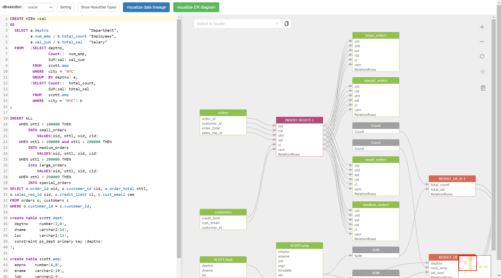

## Gudu SQLFlow Lite version for Java

[Gudu SQLFlow](https://sqlflow.gudusoft.com)  is a tool used to analyze SQL statements and stored procedures 
of various databases to obtain complex [data lineage](https://en.wikipedia.org/wiki/Data_lineage) relationships and visualize them.

[Gudu SQLFlow Lite version for Java](https://github.com/sqlparser/java_data_lineage) allows Java developers to quickly integrate data lineage analysis and 
visualization capabilities into their own Java applications. It can also be used in daily work by data scientists to quickly discover 
data lineage from complex SQL scripts that usually used in ETL jobs do the data transform in a huge data platform. 

Gudu SQLFlow Lite version for Java is free for non-commercial use and can handle any complex SQL statements 
with a length of up to 10k, including support for stored procedures. It supports SQL dialect from more than 
20 major database vendors such as Oracle, DB2, Snowflake, Redshift, Postgres and so on.

Gudu SQLFlow Lite version for Java includes [a Java library](https://www.gudusoft.com/sqlflow-java-library-2/) for analyzing complex SQL statements and 
stored procedures to retrieve data lineage relationships, and [a JavaScript library](https://docs.gudusoft.com/4.-sqlflow-widget/get-started) for visualizing data lineage relationships.

Gudu SQLFlow Lite version for Java can also automatically extract table and column constraints, 
as well as relationships between tables and fields, from [DDL scripts exported from the database](https://docs.gudusoft.com/6.-sqlflow-ingester/introduction)
and generate an ER Diagram.
  
### Build and run the program
This is a spring boot web service that integrates browser-side applications with thymeleaf. So you no longer need to install additional web containers like Nginx.

#### Prerequisites
* Install maven
* Install Java jdk1.8
#### Build
Compile with the following Maven command, The compiled jar package is under the target folder.
```
mvn package
```
Of course, you can skip this step because there is already a compiled executable in the Bin Folder.
#### Run the program
```
java -jar bin/java_data_lineage-1.1.2.jar
```
When the startup is complete, open the program in the browser at the following URL:
http://localhost:9600

The default port is 9600, if you need to change the port, for example to 8000, you can start by the following command:
```
java -jar bin/java_data_lineage-1.1.2.jar --server.port=8000
``` 

	  
### Export metadata from various databases.
You can export metadata from the database using [SQLFlow ingester](https://github.com/sqlparser/sqlflow_public/releases) 
and hand it over to Gudu SQLFlow for data lineage analysis.。

[Document of the SQLFlow ingester](https://docs.gudusoft.com/6.-sqlflow-ingester/introduction)


## Contact
For further information, please contact support@gudusoft.com