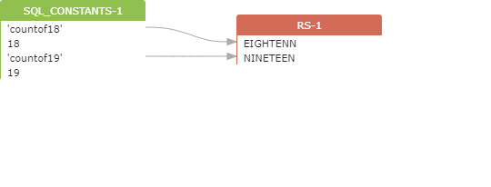
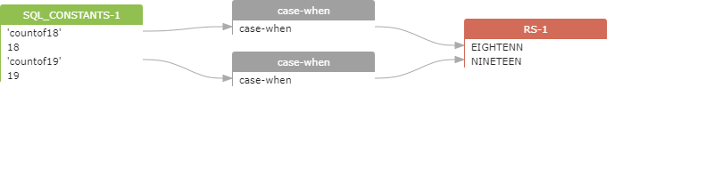

## Show ResultSet Types：case_when

oracle
```
SELECT
COUNT( CASE WHEN AGE = 18 THEN 'countof18' END) EIGHTENN,
COUNT( CASE WHEN AGE = 19 THEN 'countof19' END) NINETEEN
FROM
PeopleInfo
```
显示前：

 

显示后：

