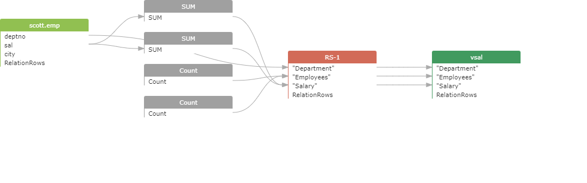
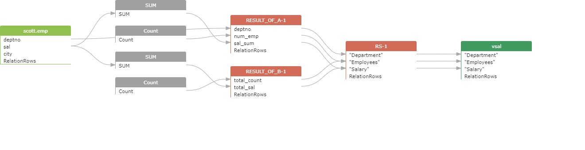

## Show ResultSet Types：result_of

oracle
```
CREATE VIEW vsal
AS
SELECT a.deptno                  "Department",
a.num_emp / b.total_count "Employees",
a.sal_sum / b.total_sal   "Salary"
FROM   (SELECT deptno,
Count()  num_emp,
SUM(sal) sal_sum
FROM   scott.emp
WHERE  city = 'NYC'
GROUP  BY deptno) a,
(SELECT Count()  total_count,
SUM(sal) total_sal
FROM   scott.emp
WHERE  city = 'NYC') b
;
```

显示前：



显示后：

