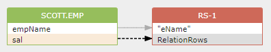
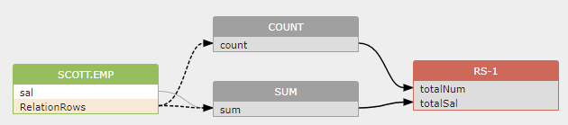

## 间接数据流和伪列介绍

本文介绍一些生成间接数据流的SQL元素。间接数据流通常由where子句、group by子句、聚合函数等中使用的列生成。

为了在列之间创建间接数据流，我们引入了一个伪列：RelationRows。

RelationRows是关系的伪列，用于表示关系中的行数。顾名思义，RelationRows不是关系（表/结果集等）中的真正列。通常，它用于表示列和关系之间的数据流。RelationRows伪列可用于源关系和目标关系。

### 1、RelationsRows在目标关系中
以下述SQL为例：
```
SELECT a.empName "eName" FROM scott.emp a Where sal > 1000
```
select列表的总行数受where子句中sal列的值影响；因此，间接数据流是这样创建的：

> scott.emp.sal -> indirect -> RS-1.RelationRows

数据流图示：



### 2. RelationsRows在源关系中
   这里是另一个示例SQL：
```
SELECT count() totalNum, sum(sal) totalSal FROM   scott.emp
```
count（）函数和sum（sal）函数的值受scott.emp源表中的行数影响。

> scott.emp.RelationRows -> indirect -> count()
> scott.emp.RelationRows -> indirect -> sum(sal)

数据流图示：



### 3. 表级别的数据流关系中的RelationsRows
   RelationRows还用于表示表级数据流。
```
alter table t2 rename to t3;
```
表级数据流不是建立在表上，而是建立在伪列RelationRows上，如下所示： 
> t2.RelationRows -> direct -> t3.RelationRows


使用RelationRows伪列构建表到表的数据流有两个原因：

如果用户需要表级溯源模型，这个用来表示表到列数据流的伪列稍后将用于生成表到表的数据流。
如果在列到列的数据流中使用同一表中的其他列，而该表本身也在表到表的数据流中，那么，该伪列将使单个表能够同时包含列到列的数据流和表到表的数据流。
以这个SQL为例
```
create view v1 as select f1 from t2;
alter table t2 rename to t3;
```
第一条create view语句将在表t2和视图v1之间生成一个列级数据流:

> t2.f1 -> direct -> RS-1.f1 -> direct -> v1.f1
> 
而第二个alter table语句将在表t2和t3之间生成表级数据流。

> t2.RelationRows -> direct -> t3.RelationRows


如您所见，表t2涉及create view语句生成的列到列的数据流，它还涉及alter Table语句生成的表到表的数据流,上图中的一个表t2显示，它既包括列到列的数据流，也包括表到表的数据流。