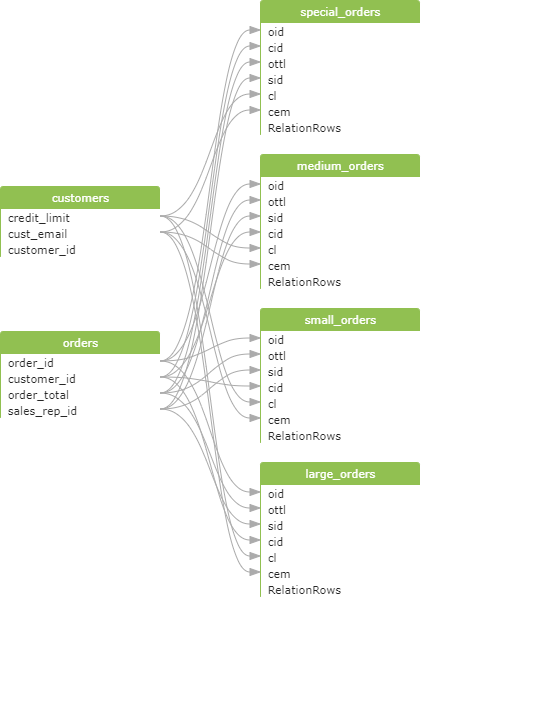
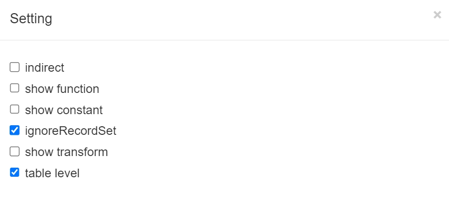
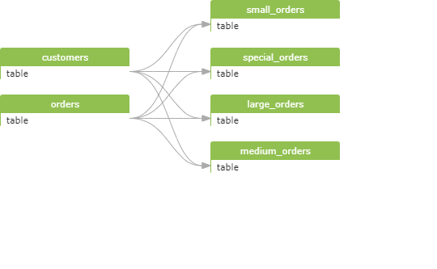

## setting: table level

oracle
```
INSERT ALL
	WHEN ottl < 100000 THEN
		INTO small_orders
			VALUES(oid, ottl, sid, cid)
	WHEN ottl > 100000 and ottl < 200000 THEN
		INTO medium_orders
			VALUES(oid, ottl, sid, cid)
	WHEN ottl > 200000 THEN
		into large_orders
			VALUES(oid, ottl, sid, cid)
	WHEN ottl > 290000 THEN
		INTO special_orders
SELECT o.order_id oid, o.customer_id cid, o.order_total ottl,
o.sales_rep_id sid, c.credit_limit cl, c.cust_email cem
FROM orders o, customers c
WHERE o.customer_id = c.customer_id;
```

以上sql未打开“table level”的情况下，可以看到显示列到列之间的血缘关系，数据流图如下：



如果您打开“table level”，数据流结果如下：


