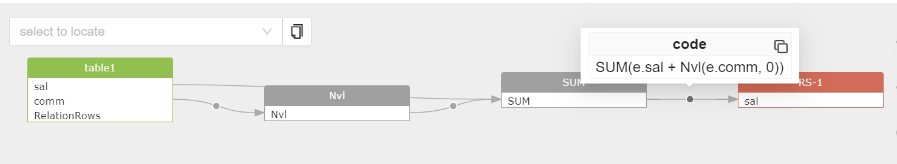

## setting: show transform

show transform 参数用来显示 SQL 语句中进行数据转换的表达式，即目标字段的数据是哪些源数据字段通过哪个表达式转换来的。例如：

oracle
```
select SUM(e.sal + Nvl(e.comm, 0)) AS sal from table1;
```
我们可以知道 sal 字段的数据通过 SUM(e.sal + Nvl(e.comm, 0)) 表达式转换而来，源数据字段为 sal 和 comm。

通过打开 show transform 参数，我们可以方便的看到这个转换过程对应的表达式。

